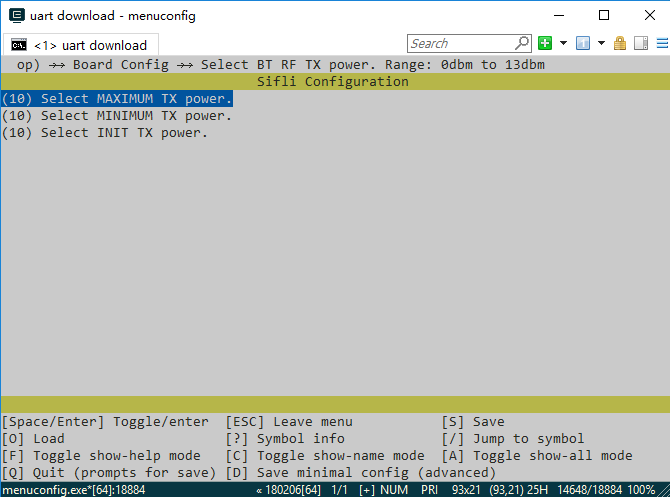

# Routine Compilation and Programming
## Compilation
If using pre-compiled image files, you can skip directly to the programming section to start testing.

Enter the example\pm\bt\project\hcpu directory and execute
```
scons --board=sf32lb52-core_n16r16 -j8 
```
Compile and generate HCPU image file (no need to compile LCPU project separately, LCPU will be automatically compiled and LCPU bin will be packaged into HCPU image when compiling HCPU). The compiled image file is saved in the build directory.


The initial transmission power configured in the project is 0dBm. If you need to test the power consumption at 4dBm transmission power, you can execute in the HCPU project directory
```
menuconfig --board=sf32lb52-core_n16r16
```
Open the menuconfig configuration menu, change all three values in the figure below to 10, save and exit, then compile to generate a new img file.



## Programming Image
Execute 
```
build_sf32lb52-core_n16r16_hcpu\uart_download.bat 
```
in the command line compilation directory to program the image file generated by compilation in the build directory.
