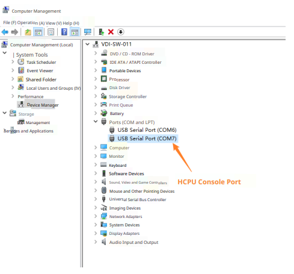

# Test Description
Use BLE routine to test typical ADV and connection scenario power consumption. After system power-on, the routine automatically starts ADV transmission. Use the LightBlue software on your phone to discover and connect to the device. Send commands through the HCPU console to modify ADV transmission interval and connection period. All commands must end with carriage return and line feed characters.

After connecting the PC and debug board with USB Type-C cable, two serial ports will be enumerated, where HCPU uses the second serial port as the console port, as shown in the figure below.

Serial port settings are shown in the figure below: baud rate is set to 1000000.

For convenient control of test conditions, use PA24 pin as the HCPU wake-up PIN. When the wake-up PIN is at low level, HCPU cannot enter low power mode. At this time, commands can be sent to HCPU through console to modify parameters. When PA24 is floating or connected to high level (i.e., 3.3V voltage, high level refers to 3.3V voltage unless otherwise specified below), HCPU enters low power mode, and LCPU periodically enters and exits low power mode. At this time, console cannot be used.

In the test routine, LCPU main frequency is 24MHz, HCPU low power mode is Deepsleep, and LCPU low power mode is Standby.

HCPU supports the following commands to modify BLE ADV and connection period, and can also use btskey command to operate menu to modify BT configuration.
* ble_config adv interval_in_ms: where interval_in_ms is the ADV interval in milliseconds;
For example: send command ble_config adv 100 to change ADV period to 100ms
* ble_config conn interval_in_ms: where interval_in_ms is the connection period in milliseconds;
For example: after connection, send ble_config conn 100 to change connection period to 100ms
