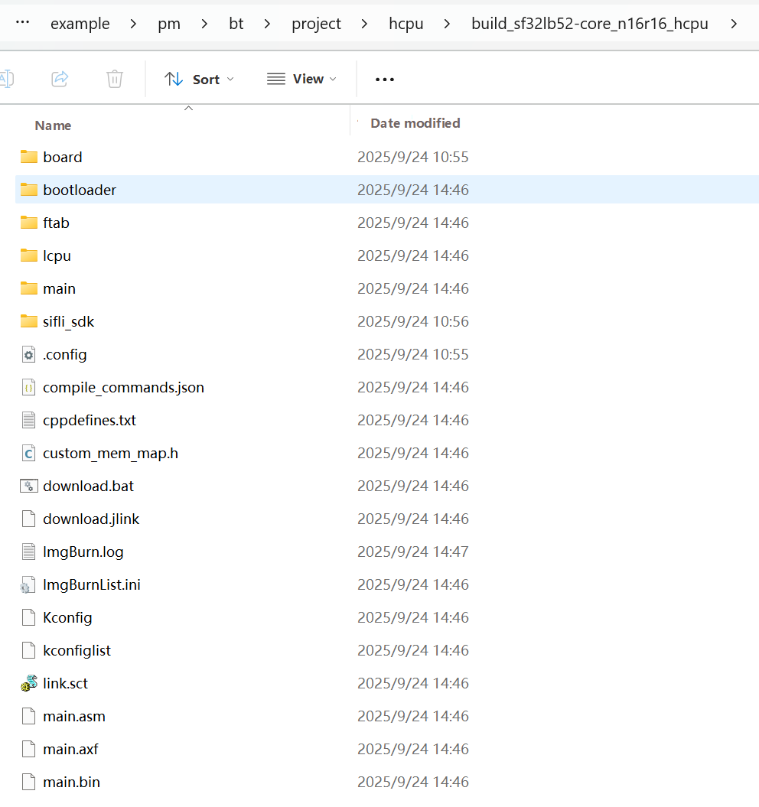

# Routine Compilation and Programming
## Compilation
Enter the example\pm\bt\project\hcpu directory and execute 
```
scons --board=sf32lb52-core_n16r16 -j8
```
Compile and generate HCPU image file. The compiled image file is saved in the build directory.


## Programming Image
Execute in the command line compilation directory 
```
build_sf32lb52-core_n16r16_hcpu\uart_download.bat
```
to program the image file generated by compilation in the build directory.

## Transmit Power Configuration
The project is configured with a default transmit power of 0 dBm. Use the command ble_tx_pwr_save x to adjust transmit power, where x represents the target power value in dBm.Example: To set transmit power to 10 dBm, run ble_tx_pwr_save 10.The device will automatically reboot for the setting to take effect after modification.