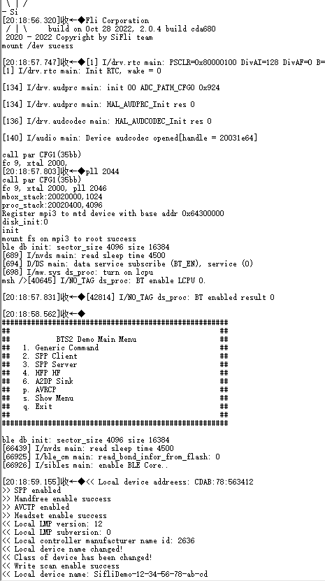
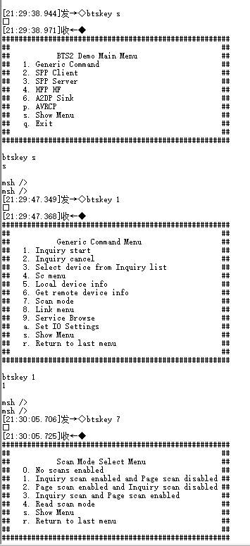

# Scan
1. * Open serial debugging tool, connect to HCPU console serial port, connect measurement device to the module under test
2. * Connect wake-up PIN to low level, reset development board, after successful startup the log shown below appears



3. * After startup, ADV, Inquiry Scan and Page Scan will all be enabled. To test Scan power consumption, ADV needs to be disabled first. The disable command is
```
diss adv_stop
```
4. * After boot, the system is in BTS main menu by default. You can configure to enable or disable Scan by sending btskey commands. Send btskey s command to display current menu, then send commands according to menu prompts to enter submenus. For example, in main menu, sending the following three commands in sequence can enable Page Scan and disable Inquiry Scan
```
(a) btskey 1
(b) btskey 7
(c) btskey 2
```



5. * Send BTS commands to configure device to send only Inquiry Scan or Page Scan, connect wake-up PIN to high level, system enters low power mode, measure 1-minute average current, record as Scan average current C1, also measure the base current between two peaks, record as sleep current C2, Scan incremental current is C=C1-C2. The Page Scan period in test program is 1.28 seconds, Inquiry Scan period is 2.56 seconds, so Inquiry Scan incremental current is half of Page Scan.

6. * Connect wake-up PIN to low level, send BTS commands to configure device to send both Inquiry Scan and Page Scan simultaneously, then connect wake-up PIN to high level, system enters low power mode, measure test average current, record as Both Scan current