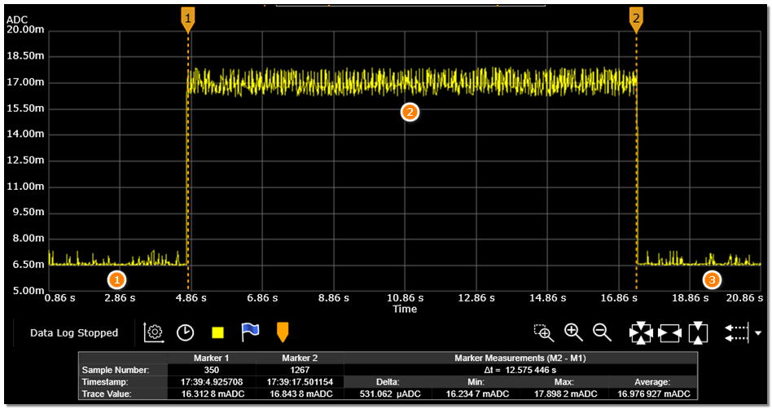

# CoreMark
### HPSYS
1. * Open the serial debugging tool, connect the HCPU console serial port, and connect the measurement device to the module under test
2. * Reset, after successful startup, the following log appears in the HCPU console as shown in the figure below

```{figure} assert/image4.png
:width: 60%
:align: center
```
3. * Send command run_coremark 192 to get average current C1, send run_coremark 168 to get average current C2, obtain the incremental current for 192MHz and 168MHz: C=(C1-C2)/(192-168)
4. * Send command run_coremark 144 to get average current C1, send run_coremark 120 to get average current C2, obtain the incremental current for 144MHz and 120MHz: C=(C1-C2)/(144-120)
5. * Send command run_coremark 48 to get average current C1, send run_coremark 24 to get average current C2, obtain the incremental current for 48MHz: C=(C1-C2)/(48-24)
6. * Send command run_coremark 24 to get average current C1, send run_coremark 12 to get average current C2, obtain the incremental current for 24MHz and 12MHz: C=(C1-C2)/(24-12)
7. * As shown in the figure below, Phase 1 is the current waveform in WFI mode when HCPU runs at 192MHz main frequency. After starting to execute CoreMark, it enters Phase 2, where the current rises and remains until the test ends. Phase 3 is the current waveform returning to WFI mode


For frequencies such as 48MHz/24MHz/12MHz, the coremark execution time will be very long. It is not necessary to wait for the test to complete. After measuring the current value, you can reset and test the next item.

