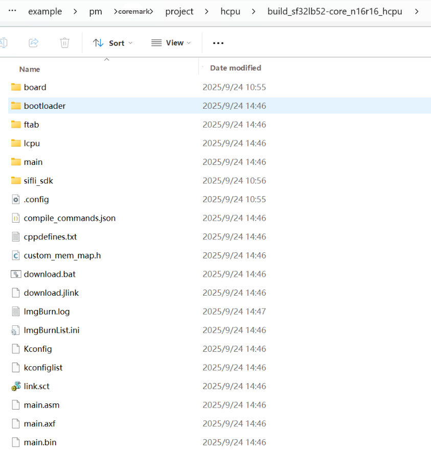

# Building and Flashing the Example
## Building
If you are using a prebuilt image file, you can skip directly to the flashing section and begin testing after flashing it.

Navigate to the `example\pm\coremark\project\hcpu` directory.

For the sf32lb52-core_n16r16 development board, build the example with the following command:

```
scons --board=sf32lb52-core_n16r16 -j8
```

For the sf32lb52-core_n4 development board, build the example with the following command:

```
scons --board=sf32lb52-core_n4 -j8
```

This generates the HCPU image file, which is stored in the `build` directory.



## Flashing the Image
From the command-line directory where the project was built, run the following command to flash the generated image from the `build` directory. Make sure the board model is correct. If you are using an N4 board, change the board name accordingly.

```
build_sf32lb52-core_n16r16_hcpu\uart_download.bat
```
