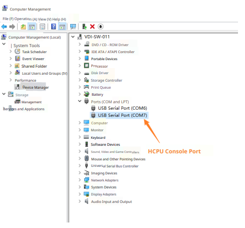

# Test Description
CoreMark routine tests power consumption in the following scenarios:
* One core executes CoreMark benchmark test program
* One core executes while loop for a period of time, executing nop instruction in the loop
* System shutdown, can be woken up by RTC timer
* System shutdown, woken up by key press

When LCPU executes test commands, HCPU automatically enters DeepSleep low power mode. During this period, HCPU cannot respond to console commands. After test completion, HCPU exits low power mode and new test commands can continue to be sent. If LCPU test never ends, you can connect PA30 to low level to force wake up HCPU. However, note that when measuring current, PA24 cannot be connected to low level, it must be connected to high level or left floating, otherwise it will cause measurement values to be high.

LCPU never enters low power mode. When not executing tasks, LCPU is in WFI state.

Note that all commands sent must end with carriage return and line feed characters.

After connecting PC and debug board with USB Type-C cable, two serial ports will be enumerated. HCPU uses the second serial port as console port, as shown below.

Serial port settings are shown below, with baud rate set to 1000000.

HCPU can use the following commands to start corresponding tasks:
* run_coremark freq_in_mhz: Modify main frequency and execute CoreMark, freq_in_mhz is frequency in MHz units
For example: run_coremark 48, execute CoreMark at 48MHz main frequency
* run_while_loop freq_in_mhz: Modify main frequency and execute while loop for a period of time, freq_in_mhz is frequency in MHz units
For example: run_while_loop 48, execute while loop at 48MHz main frequency

Use HCPU console to send the following commands to make LCPU execute specified tasks:
* tolcpu run_coremark freq_in_mhz
* tolcpu run_while_loop freq_in_mhz

Command meanings are the same as HCPU.
HCPU also supports the following command:
* shutdown [wakeup_time_in_sec]: Shutdown, wakeup_time_in_sec is optional parameter in seconds, indicating how long after shutdown to automatically power on. If no parameter is provided, it can only be woken up by KEY1 key press after shutdown.

Note: Due to compilation using Ofast optimization level, benchmark results are for reference only and cannot reach the highest score when using Omax.