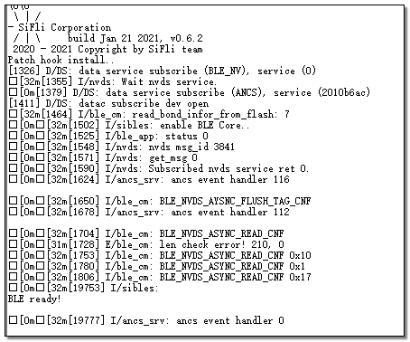
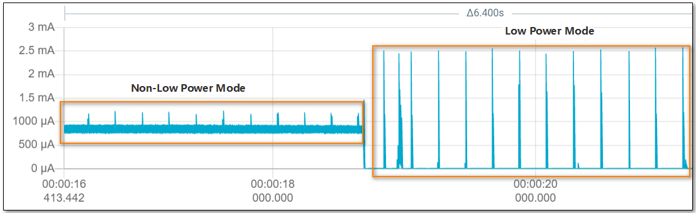
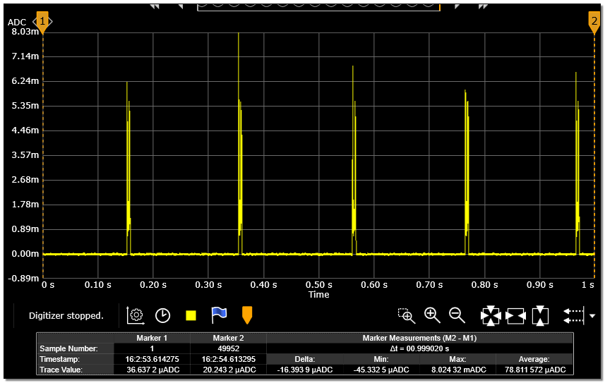

# ADV Scenario
1. * Open serial debugging tool, connect to HCPU console serial port, connect measurement device to the module under test
2. * Connect wake-up PIN to low level, press Reset key on the baseboard to reset. After successful startup, the log shown in the figure below appears


3. * The default ADV period after startup is 200ms. Since Inquiry Scan and Page Scan will also be automatically enabled, to test BLE power consumption, you need to use btskey command to disable Scan. Refer to the Scan section of classic Bluetooth for disable commands. For example, first send btskey s command. If it shows you are currently in the main menu, you can send the following three commands in sequence to disable Page Scan and Inquiry Scan. After sending btskey0, you can send btskey 4 again to query the Scan status.
```
(a) btskey 1
(b) btskey 7
(c) btskey 0
```
4. * Connect wake-up PIN to high level, system enters low power mode, current value drops significantly as shown in the figure below. Measure current at 200ms interval. The current waveform in low power mode is shown in the ADV=200ms current waveform diagram. Record the 10-second average current as C1, the current between two peaks as sleep current C2, and the ADV incremental current C=C1-C2

<div align="center"><strong>Current change when entering low power mode</strong></div>


<div align="center"><strong>Current waveform for ADV=200ms</strong></div>

5. * Connect wake-up PIN to low level, system exits low power mode, send command ble_config adv 500 in console to change ADV interval to 500ms
6. * Connect wake-up PIN to high level, system enters low power mode again, measure current at 500ms interval

Repeat steps 5 and 6 to measure current when ADV interval is 1000ms.