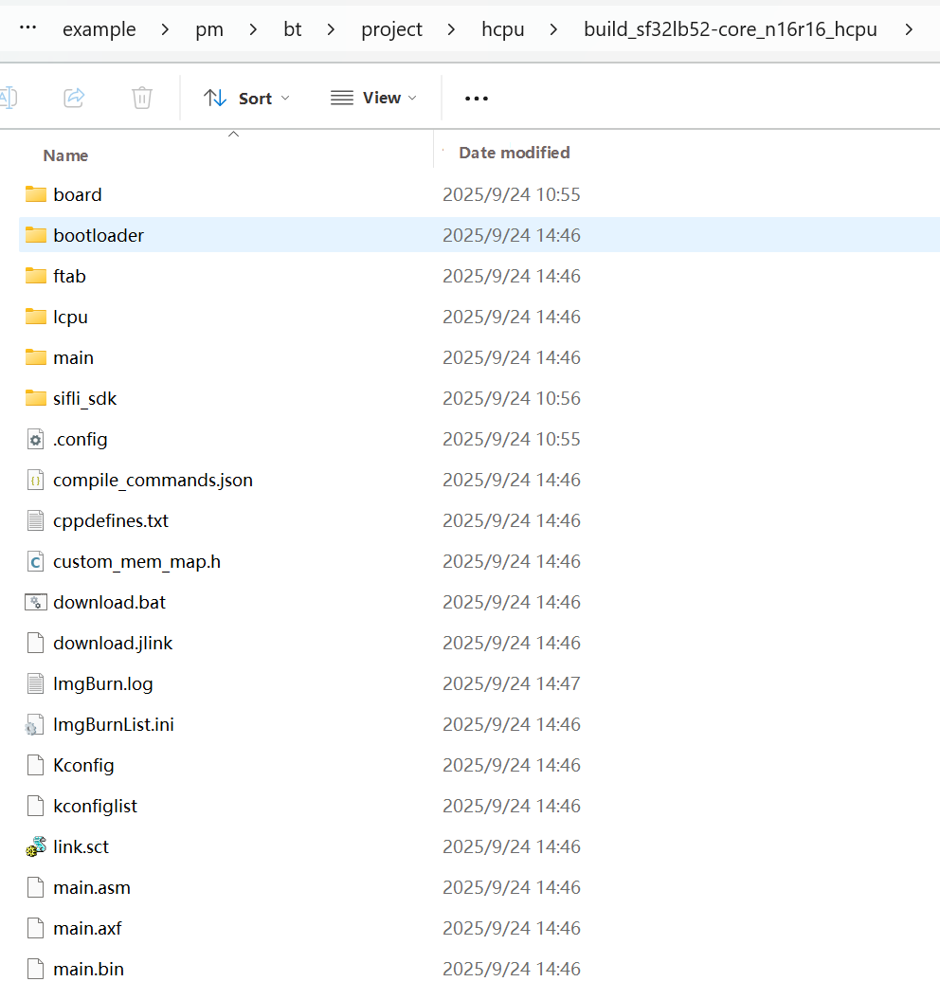

# Routine Compilation and Programming
### Compilation
Enter the example\pm\bt\project\hcpu directory and execute 
```
scons --board=sf32lb52-core_n16r16 -j8
```
Compile and generate HCPU image file. The compiled image file is saved in the build directory.


The initial transmission power configured in the project is 0dBm. If you need to test power consumption at 4dBm transmission power, you can execute in the HCPU project directory
```
menuconfig --board=sf32lb52-core_n16r16
```
to open the menuconfig configuration menu, change all three values in the figure below to 10, save and exit, then compile to generate a new img file.


### Programming Image
Execute in the command line compilation directory 
```
build_sf32lb52-core_n16r16_hcpu\uart_download.bat
```
to program the image file generated by compilation in the build directory.