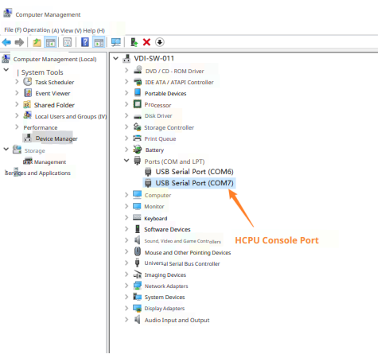

# Test Description
Use BT routine to test power consumption of Scan and Sniff modes. After system power-on, the test routine automatically enables Scan and ADV. Use phone to connect to Bluetooth device. Commands can be sent in HCPU console to modify configuration. All commands must end with carriage return and line feed.

After connecting PC and debug board with USB Type-C cable, two serial ports will be enumerated, where HCPU uses the second serial port as console port, as shown below.

Serial port settings are shown below, with baud rate set to 1000000.

For convenient control of test conditions, use PA24 as HCPU wake-up PIN. When wake-up PIN is at low level, HCPU cannot enter low power mode. At this time, commands can be sent to HCPU through console to modify parameters. When PA24 is floating or connected to high level (i.e., 3.3V voltage, high level refers to 3.3V voltage unless otherwise specified below), HCPU enters low power mode, and LCPU periodically enters and exits low power mode. At this time, console cannot be used.

In the test routine, LCPU main frequency is 24MHz, HCPU low power mode is Deepsleep, and LCPU low power mode is Standby. HCPU uses btskey command to operate menu to modify configuration.
