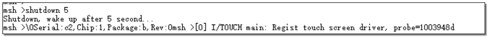

# Shutdown
1. * Open serial debugging tool, connect to HCPU console serial port
2. * Reset, after successful startup the log shown below appears in HCPU console

3. * Send command shutdown, instructing system to shut down. After shutdown, it can only be woken up by KEY1 key press. Since shutdown current is relatively small, it is recommended to use a multimeter for measurement
4. * Press KEY1 key to wake up system, console shows startup phase log again, but version number log will not appear
5. * Send command shutdown 5, as shown below, instructing system to shut down and automatically power on after 5 seconds. For convenient measurement, the waiting time can be extended

