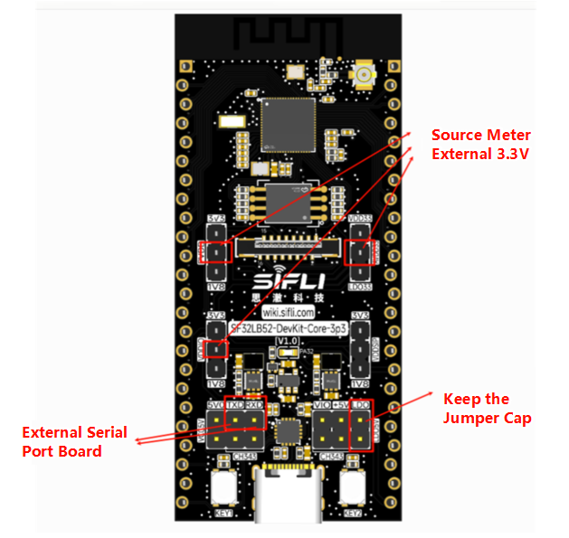

# Power Consumption Measurement Method
Use PPK to simultaneously supply 3.3V power to PVDD, AVDD33, and VDDIO. The power supply pins are outlined in the diagram. Remove all other jumper caps and keep the LDO5V jumper cap. Connect TXD and RXD to an external serial port board for command input.

