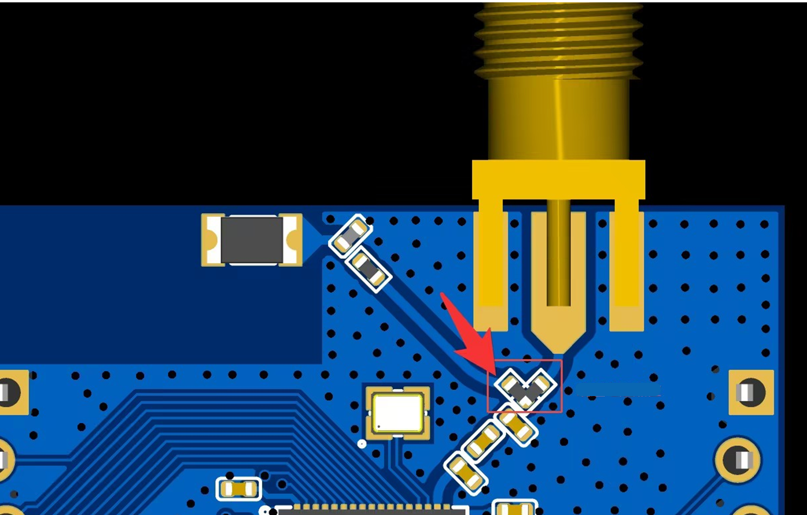

# Power Measurement Method
Use a power measurement instrument to supply 3.3 V simultaneously to PVDD, AVDD33, and VDDIO. The supply pins are highlighted in the figure. Remove all other jumpers and keep the LDO5V jumper in place. Connect TXD and RXD to an external USB-to-UART board to input commands.

The development board uses the on-board antenna by default for RF transmit and receive. You may choose to switch to an external antenna.

### How to Switch to an External Antenna

1. Required hardware: SMA connector + antenna (or a 50-ohm load). Specification: 50-ohm RF load or 50-ohm RF antenna.

2. First, solder the antenna and SMA connector as shown below.

3. Then change the orientation of the selection resistor as shown to point to the external antenna. By default, it points to the on-board antenna.

