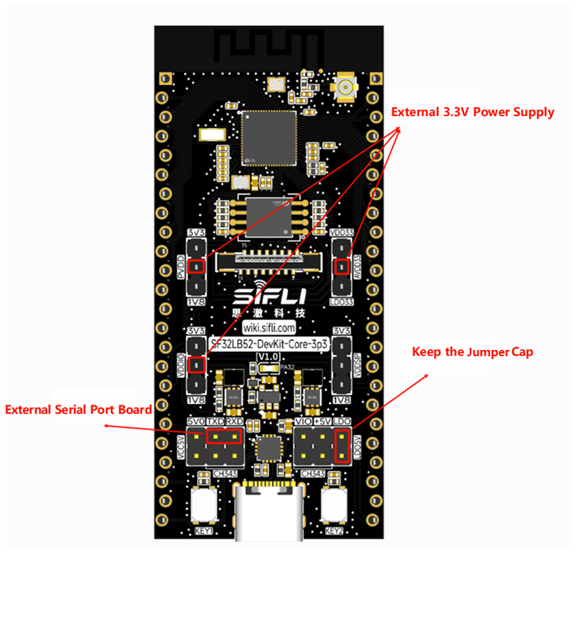
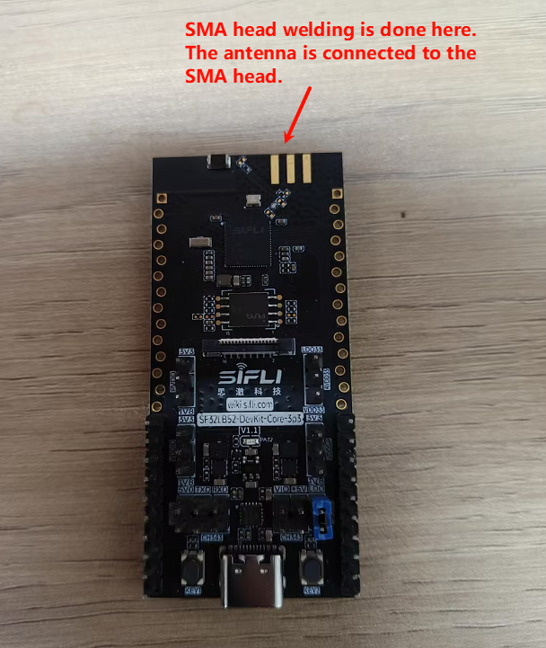

# Power Consumption Measurement Method
Use power measurement instruments to supply 3.3V simultaneously to PVDD, AVDD33, and VDDIO. The supply pins are highlighted in the figure. Remove all other jumpers and keep the LDO5V jumper. Connect TXD and RXD to an external serial (UART) board to input commands.

Additionally, the antenna section requires handling: attach an SMA connector with an antenna (or a 50-ohm load). Specification: a 50-ohm RF load or a 50-ohm RF antenna. If not handled, ADV data may slightly deviate from expectations. If an antenna is not available, you can measure without it first; later check whether the ADV data deviates from expectations and then decide whether to add the antenna.

- Antenna diagram

