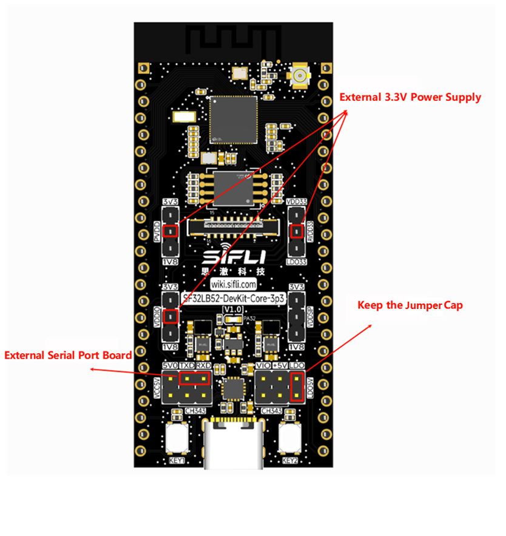
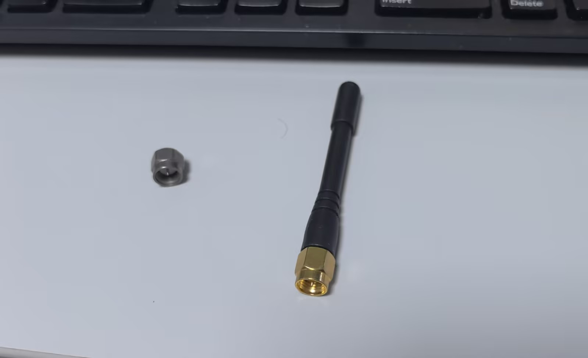
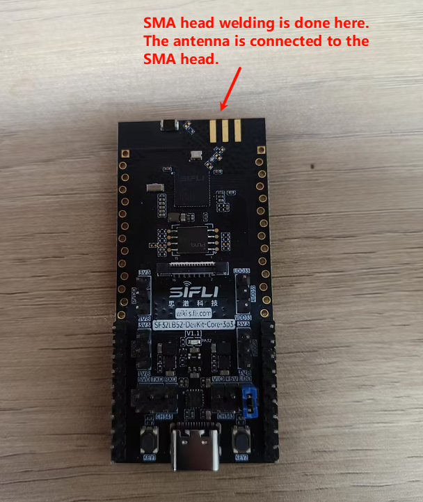

# Power Consumption Measurement Method
Use a power measurement instrument to supply 3.3 V to the pins shown in the figures below. The power supply pins are highlighted in the figures. Remove all other jumper caps except the LDO5V jumper cap. Connect the TXD and RXD pins to an external USB-to-serial adapter for command input.

Two development board models are currently used for SF32LB52 power consumption testing: sf32lb52-core_n16r16 and sf32lb52-core_n4. Their power supply connections differ slightly. Connect the power supply as shown for the corresponding board model.

## Using the sf32lb52-core_n16r16 Development Board

## Using the sf32lb52-core_n4 Development Board

By default, the development board uses its onboard antenna to transmit and receive RF signals. You can replace it with an external antenna if required.

### Connecting an External Antenna

1. Required hardware: an SMA connector and an antenna (or a 50-ohm load). Use either a 50-ohm RF load or a 50-ohm RF antenna.

2. Solder the antenna and SMA connector as shown below.

3. Change the orientation of the resistor shown in the figure so that it routes the RF signal to the external antenna. By default, it routes the signal to the onboard antenna.

