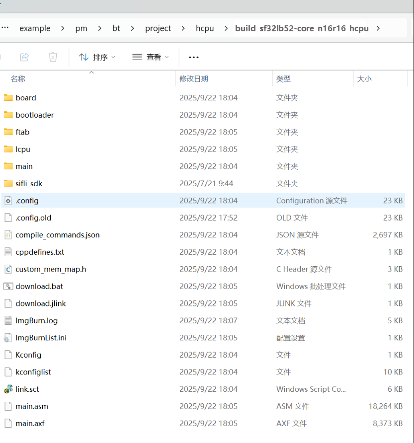

# 例程编译与烧写
## 编译
如果使用已编译好的 image 文件，可以直接跳到烧录部分进行烧录开始测试。

如果使用的是sf32lb52-core_n16r16开发板，就使用如下命令编译：

```
scons --board=sf32lb52-core_n16r16 -j8 
```

如果使用的是sf32lb52-core_n4开发板，就使用如下命令编译：

```
scons --board=sf32lb52-core_n4 -j8 
```

编译生成HCPU的image文件(不需要单独编译LCPU 的工程，编译 HCPU 时会自动编译 LCPU 并打包 LCPU 的 bin 到 HCPU 的镜像中)，编译生成的 image 文件保存在 build 目录下。




## 烧录镜像
在命令行编译的目录下执行以下命令来烧写 build 目录下编译生成的镜像文件，注意板子型号，如果是n4的板子请注意更改板子名称
```
build_sf32lb52-core_n16r16_hcpu\uart_download.bat
```

## 改变发射功率
工程默认配置的发射功率是0dbm，可以使用`ble_tx_pwr_save x`命令修改发射功率，x是需要修改的发射功率大小，例如改变发射功率为10dbm：`ble_tx_pwr_save 10` 。改完后会自动重启生效。