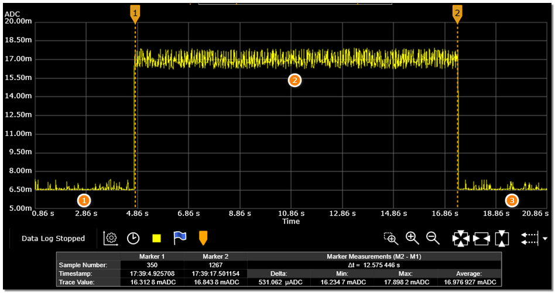

# CoreMark
### HPSYS
1. * 打开串口调试工具，连接 HCPU 的 console 串口，连接测量设备与被测模块
2. * 复位，启动成功后在 HCPU 的 console 中出现如下图的 log

```{figure} assert/image4.png
:width: 60%
:align: center
```
3. * 发送命令run_coremark 192得到平均电流C1，发送run_coremark 168得到平均电流C2，得到192MHz和168MHz的增量电流 C=(C1-C2)/(192-168)
4. * 发送命令run_coremark 144得到平均电流C1，发送run_coremark 120得到平均电流C2，得到144MHz和120MHz的增量电流 C=(C1-C2)/(144-120)
5. * 发送命令run_coremark 48得到平均电流C1，发送run_coremark 24得到平均电流C2，得到48MHz的增量电流 C=(C1-C2)/(48-24)
6. * 发送命令run_coremark 24得到平均电流C1，发送run_coremark 12得到平均电流C2，得到24MHz和12MHz的增量电流 C=(C1-C2)/(24-12)
7. * 如下图所示，阶段 1 是 HCPU 跑在 192MHz 主频时 WFI 模式下的电流波形，开始执行 CoreMark后进入阶段 2，电流上升并保持至测试结束，阶段 3 为回到 WFI 模式的电流波形


48MHz/24MHz/12MHz 等频率下 coremark 执行时间会很长，不必等待测试完成，测量得到电流值后可以复位测试下一项。

