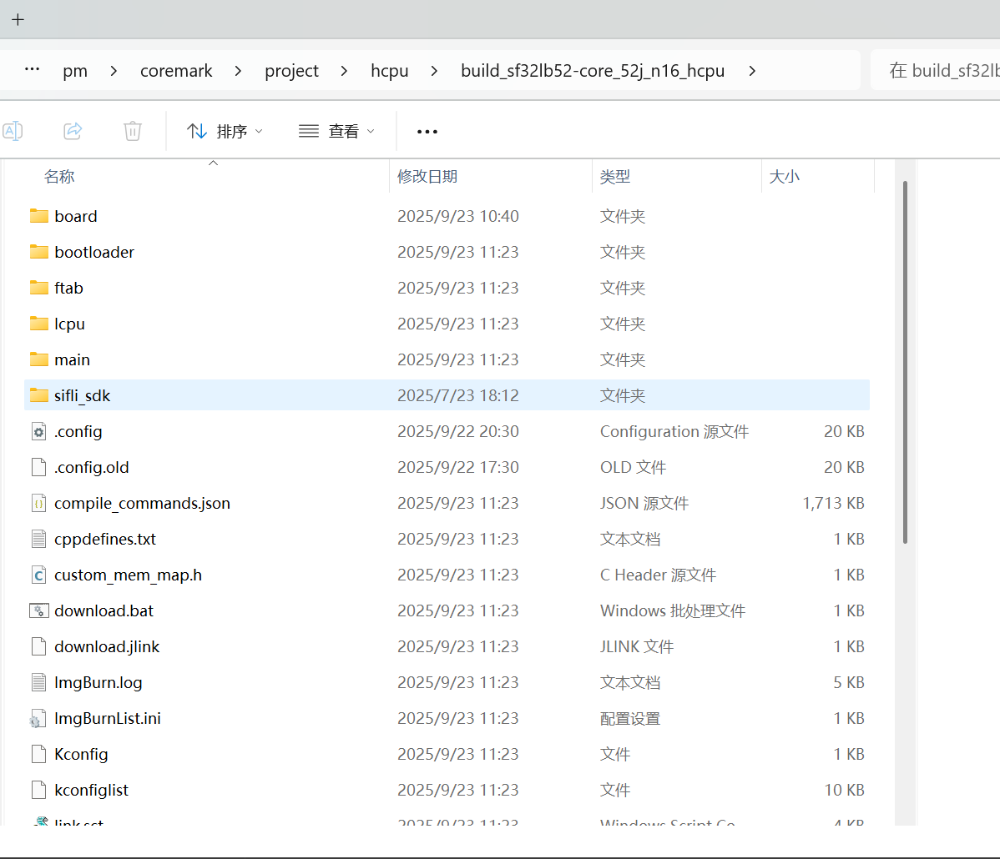

# 例程编译与烧录
## 编译
如果使用已编译好的 image 文件，可以直接跳到烧录部分进行烧录开始测试。
进入example\pm\coremark\project\hcpu目录，执行
```
scons --board=sf32lb52-core_n16r16 -j8 
```
编译生成HCPU的image文件，编译生成的 image文件保存在 build 目录下。



## 烧录镜像
在命令行编译的目录下执行
```
build_sf32lb52-core_n16r16_hcpu\uart_download.bat
```
烧写 build 目录下编译生成的镜像文件。