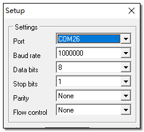

# 测试说明
CoreMark 例程测试以下场景下的功耗:
* 一个核执行 CoreMark 基准测试程序
* 一个核执行一段时间的 while 循环，循环中执行 nop 指令
* 系统关机，可由 RTC 定时唤醒
* 系统关机，由按键唤醒

LCPU 执行测试命令时 HCPU 自动进入 DeepSleep 低功耗模式，这期间 HCPU 无法响应 console 命令，测试完成后 HCPU 退出低功耗模式，此时可以继续发送新的测试命令，如果 LCPU 测试一直没有结束，可以将 PA30接低电平，强制唤醒 HCPU，但需要注意，测量电流时，PA24 不能接低电平，必须接高电平或者悬空，否则会导致测量值偏高。

LCPU 始终不进入低功耗模式，当不执行任务时 LCPU 处于 WFI 状态。

需要注意发送的命令都要以回车换行符结尾。

PC 与调试板使用 USB Type-C 线连接后会枚举出两个串口，HCPU 使用第二个串口作为 console 端口，如下图所示。

串口设置参见下图，波特率均设置为 1000000。

HCPU 可使用以下命令启动相应任务：
* run_coremark freq_in_mhz：修改主频并执行 CoreMark，freq_in_mhz是以 MHz 为单位的频率
例如：run_coremark 48，以 48MHz 主频执行 CoreMark
* run_while_loop freq_in_mhz：修改主频并执行一段时间 while loop，freq_in_mhz是以 MHz 为单位的频率
例如：run_while_loop 48，以 48MHz 主频执行 while loop

使用 HCPU 的 console 发送以下命令，可以让 LCPU 执行指定任务：
* tolcpu run_coremark freq_in_mhz
* tolcpu run_while_loop freq_in_mhz

命令含义同 HCPU。
HCPU 还支持以下命令：
* shutdown [wakeup_time_in_sec]: 关机，wakeup_time_in_sec为可选参数，单位为秒，表示关机后多久自动开机，如果不带参数，则关机后只能被 KEY1 按键唤醒

注：由于编译采用 Ofast 优化等级，跑分结果仅作参考，并不能达到 Omax 时的最高分。