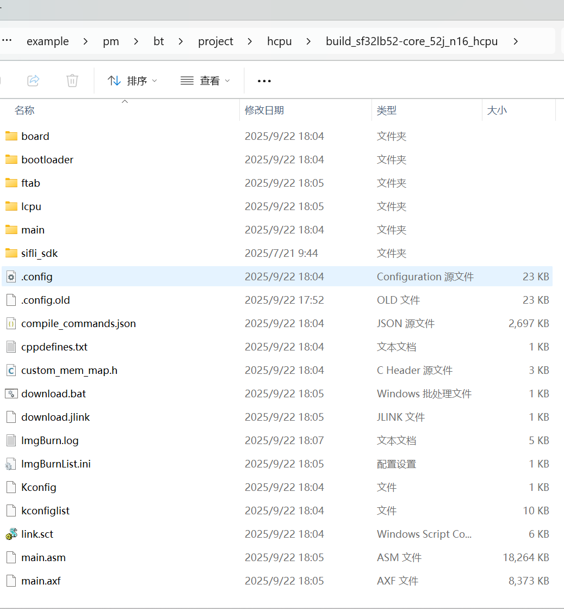

# 例程编译与烧写
### 编译
如果使用已编译好的 image 文件，可以直接跳到烧录部分进行烧录开始测试。

进入example\pm\bt\project\common\hcpu目录，执行
```
scons --board=sf32lb52-core_n16r16 -j8 
```
编译生成HCPU的image文件(不需要单独编译LCPU 的工程，编译 HCPU 时会自动编译 LCPU 并打包 LCPU 的 bin 到 HCPU 的镜像中)，编译生成的 image 文件保存在 build 目录下。



工程配置的初始发射功率为0dBm，如果需要测试 4dBm 的发射功率功耗，可以在HCPU工程目录下执行
```
menuconfig --board=sf32lb52-core_n16r16
```
打开 menuconffg的配置菜单，将下图中的三个数值都改为 10，保存退出，编译生成新的 img 文件。


### 烧写镜像
在命令行编译的目录下执行 build_sf32lb52-core_n16r16_hcpu\uart_download.bat 烧写 build 目录下编译生成的镜像文件。
