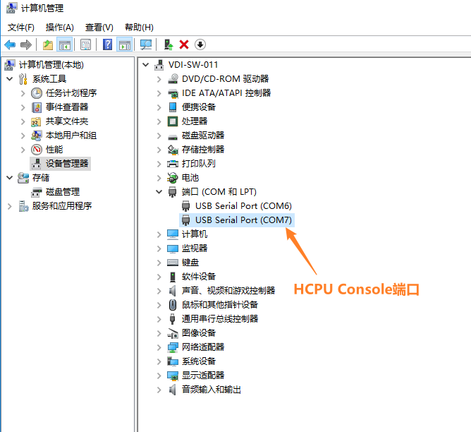
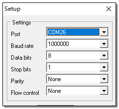

# 测试说明
使用 BLE 例程可以测试典型的 ADV 和连接场景功耗，系统上电后例程自动开启 ADV 发送，使用手机的 LightBlue软件发现并连接设备，通过 HCPU 的 console 发送命令修改 ADV 发送间隔和连接周期，发送的命令都要以回车换行符结尾。

PC 与调试板使用 USB Type-C 线连接后会枚举出两个串口，其中 HCPU 使用第二个串口作为 console 端口，如
下图所示。

串口设置参见下图：波特率均设置为 1000000。

为便于控制测试条件，使用 PA24 引脚作为 HCPU 的唤醒 PIN。当唤醒 PIN 为低电平时 HCPU 无法进入低功耗模式，此时可以通过 console 给 HCPU 发送命令修改参数，当 PA24 悬空或者接高电平（即 3.3V 电压，下文如未特别说明，高电平均指 3.3V 电压）时，HCPU 进入低功耗模式，LCPU 则周期性的进出低功耗模式，此时 console 无法使用。

测试例程 LCPU 的主频为 24MHz，HCPU 的低功耗模式为 Deepsleep，LCPU 的低功耗模式为 Standby。

HCPU 支持如下命令修改 BLE ADV 和连接周期，同时还可使用 btskey 命令操作菜单修改 BT 的配置。
* ble_config adv interval_in_ms: 其中interval_in_ms是毫秒为单位的 ADV 间隔；
例如：发送命令ble_config adv 100，可将 ADV 周期改为 100ms
* ble_config conn interval_in_ms: 其中interval_in_ms是毫秒为单位的连接周期；
例如：在连接之后发送ble_config conn 100，可将连接周期改为 100ms
