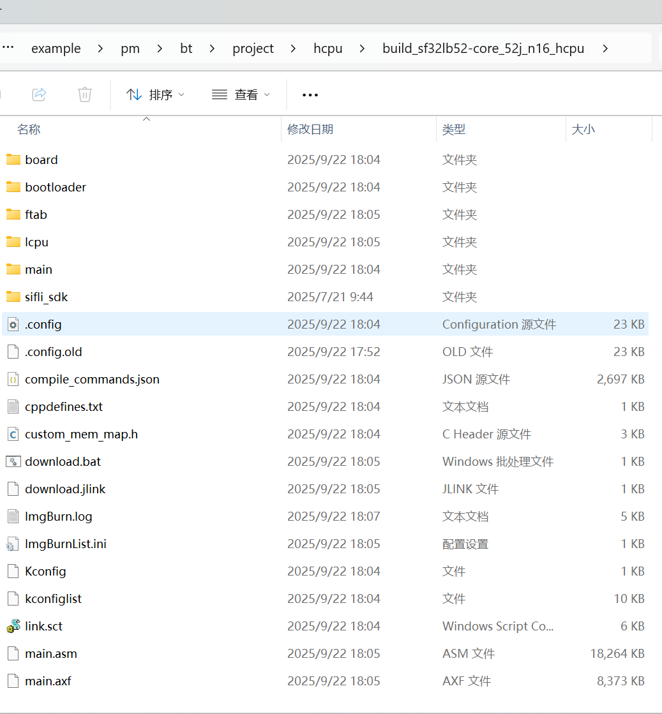
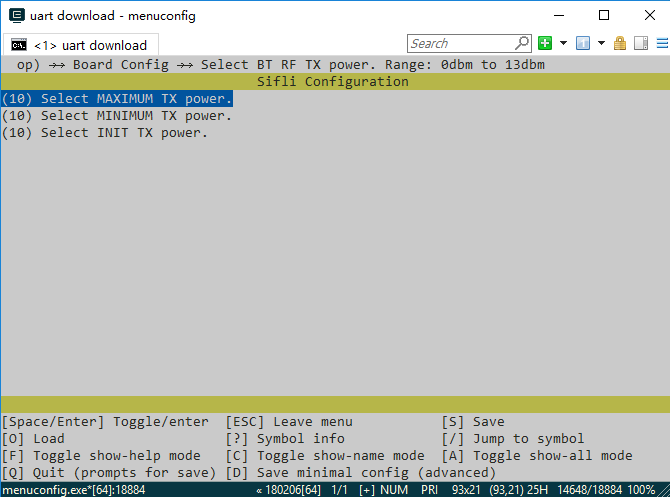

# 例程编译与烧录
### 编译
进入example\pm\bt\project\hcpu目录，执行 
```
scons --board=sf32lb52-core_n16r16 -j8
```
编译生成HCPU的image文件，编译生成的 image文件保存在 build目录下。


工程配置的初始发射功率为0dBm，如果需要测试 4dBm 的发射功率功耗，可以在HCPU工程目录下执行
```
menuconfig --board=sf32lb52-core_n16r16
```
来打开 menuconffg的配置菜单，将下图中的三个数值都改为 10，保存退出，编译生成新的 img 文件。


### 烧写镜像
在命令行编译的目录下执行 
```
build_sf32lb52-core_n16r16_hcpu\uart_download.bat
```
烧写 build目录下编译生成的镜像文件。