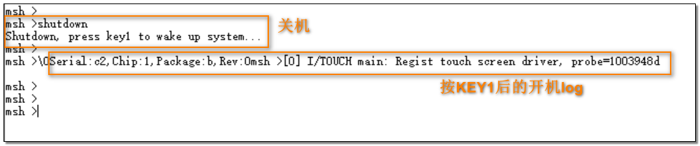

# 关机
1. * 打开串口调试工具，连接 HCPU 的 console 串口
2. * 复位，启动成功后在 HCPU 的 console 中出现如下图的 log

3. * 发送命令shutdown，指示系统关机，关机后只能被 KEY1 按键唤醒，由于关机电流比较小，建议使用万用
表测量
4. * 按 KEY1 键唤醒系统，console 中再次出现开机阶段的 log，但不会出现版本号的 log
5. * 发送命令shutdown 5，如下图指示系统关机并在 5 秒后会自动开机，为了便于测量，可以将等待时间延长

