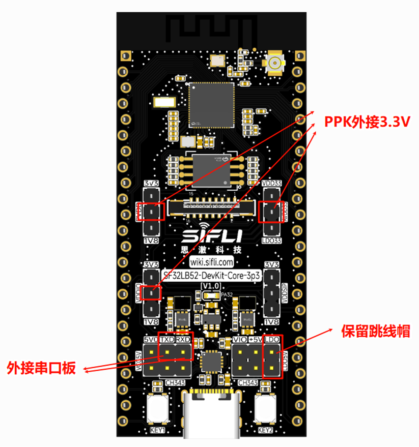
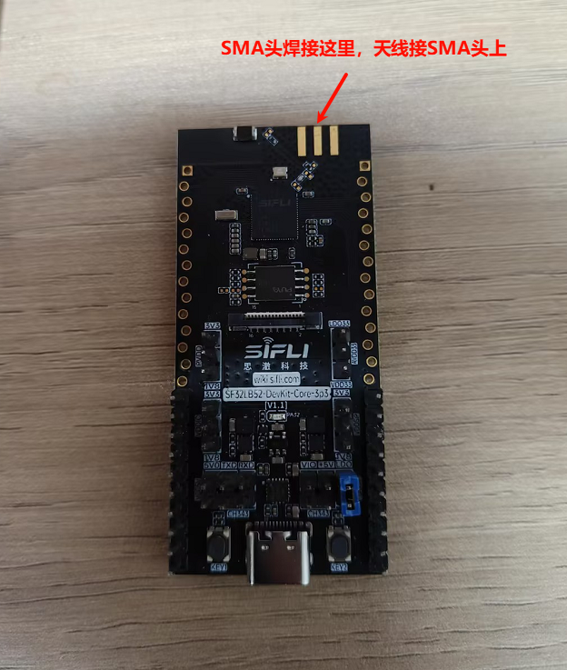

# 功耗测量方法
使用功耗测试仪器同时对PVDD，AVDD33,VDDIO进行3.3V供电，供电的针脚如图框出，其余跳线帽全部去除，保留LDO5V的跳线帽，TXD与RXD外接串口板用来输入命令

另外需要对天线这块进行处理，需要接个SMA头+天线（或50欧姆负载），规格为：50欧姆的射频负载或是50欧姆的RF天线。不进行处理的话ADV的数据可能会与预期有一点出入。如果没有天线的话可以先不接天线测，到时候看一下ADV的数据和预期是否有出入再决定是否要接天线。

* 天线图

