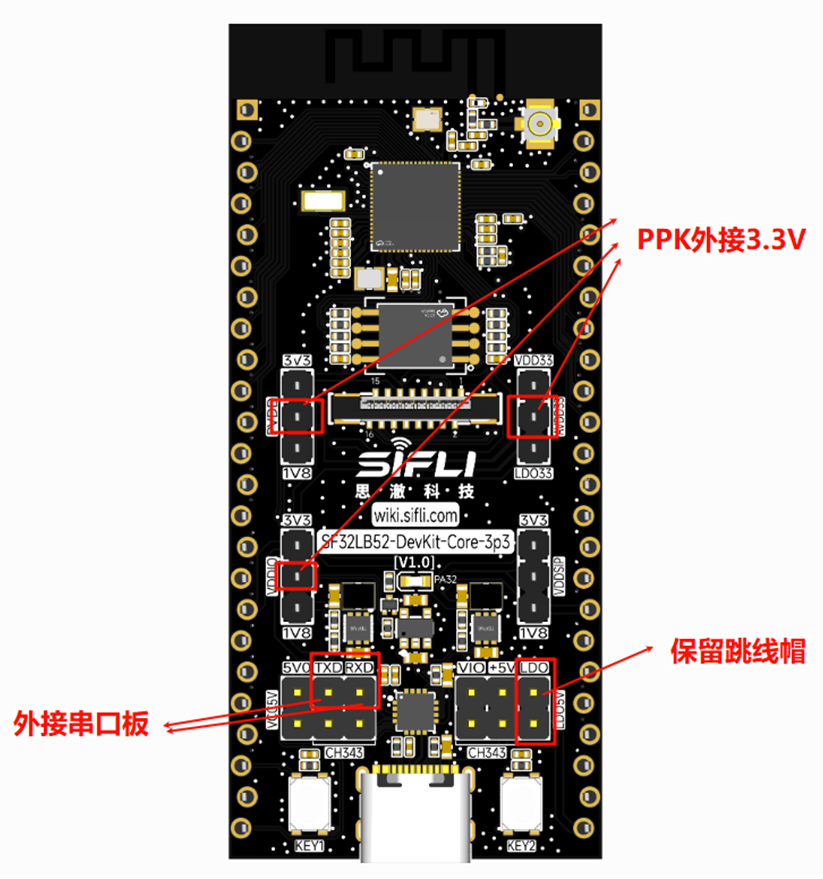
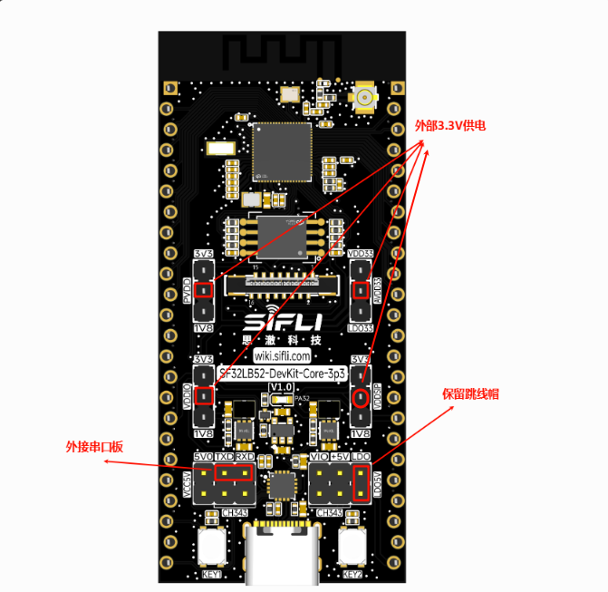
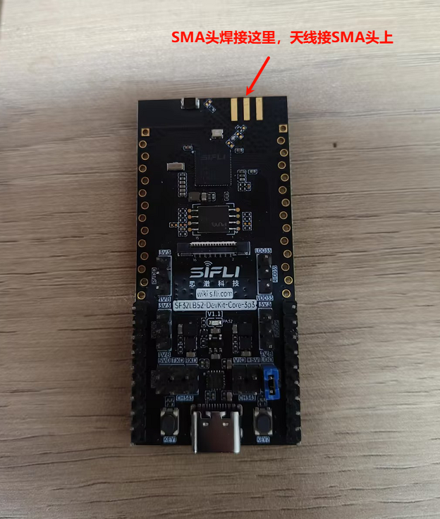
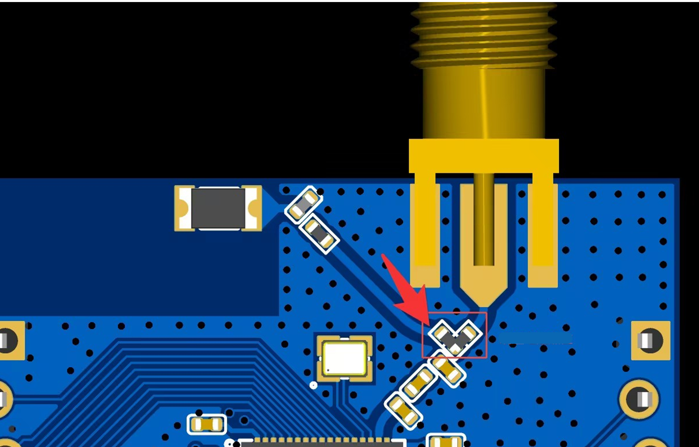

# 功耗测量方法
使用功耗测试仪器同时如下图的引脚进行3.3V供电，供电的针脚如图框出，其余跳线帽全部去除，保留LDO5V的跳线帽，TXD与RXD外接串口板用来输入命令

目前测试52功耗有两种开发板型号：sf32lb52-core_n16r16 与 sf32lb52-core_n4，两种型号的板子供电有一些差异，请根据对应的板子型号如图方式供电

## 使用 sf32lb52-core_n16r16 开发板

## 使用 sf32lb52-core_n4 开发板

开发板上默认使用板载天线进行射频信号收发，也可自行选择更换为外接天线。
### 更换外接天线方法

1. 需要的硬件：SMA头+天线（或50欧姆负载），规格为：50欧姆的射频负载或是50欧姆的RF天线。

2. 先将天线以及SMA头按照如下图所示进行焊接

3. 随后将如图挑选电阻方向更换为指向外接天线，默认是指向板载天线的

